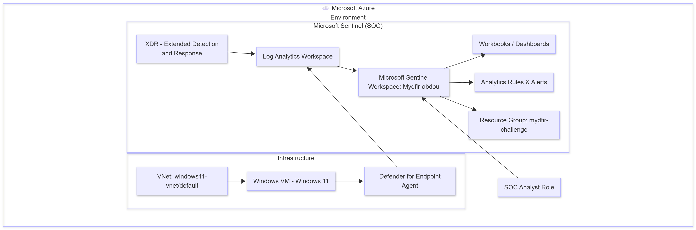

# 🛡️ MYDFIR 30-Day Microsoft Challenge

## 🎯 Purpose

I recently joined the **MyDFIR SOC Communty Program**, which is designed to help participants gain **hands-on experience** and develop **job-ready cybersecurity skills** through practical labs, guided projects, and real-world simulations.  

As part of this journey, I’m sharing my work on the **Microsoft 30-Day Security Challenge**, one of several projects within the program. 

By documenting my progress, I aim to showcase my technical growth, demonstrate my ability to apply SOC concepts in real-world scenarios, and strengthen my expertise in cybersecurity operations.

---

## 📘 Project Overview
This repository documents my progress in the **Microsoft 30-Day Challenge**, where I’m building and managing a **cloud-based  (SOC)** from scratch using **Microsoft Sentinel** and other Microsoft security tools.

The goal of this challenge is to gain hands-on experience in modern cloud SOC operations from environment setup to incident investigation and response, with a focus on phishing analysis, threat detection, and incident reporting.

**Tools used**
- Microsoft Sentinel  
- Microsoft Azure  
- Microsoft Defender for Endpoint  
- Microsoft 365 Security  

**Skills practiced**
- SOC environment setup and configuration  
- KQL (Kusto Query Language) for detection & hunting  
- Incident investigation and reporting  
- Install Microsoft Defender XDR connector
- Create Analytics rule in Defender XDR

---
## Current Soc Diagram

## 🧰 Current Lab Environment
- **Cloud:** Microsoft Azure (Subscription: *abdou*****@.onmicrosoft.com*)  
- **SOC:** Microsoft Sentinel (Workspace: *Mydfir-abdou*)  
- **Resource Group:** (mydfir-challenge)
- **Endpoints:** 1 Windows VM (windows11)
- **Network:** VNet (windows11-vnet/default)
- **Roles:** SOC Analyst role  
- **Log Analytics:** (Mydfir-abdou-law)
- - **Connected Data Sources:**
  - Microsoft 365
  - Defender for Endpoint
  - **XDR (Extended Detection and Response) from Microsoft Content Hub**

---

## 📦 Resources Created So Far
- [x] Azure Subscription  
- [x] Create Azure VM 
- [x] Microsoft Sentinel workspace  
- [x] Connected Data Connectors: Microsoft 365, Defender for Endpoint, Entra ID  
- [x] Custom Workbook / Dashboard (Screenshots in `/Screenshots`)  
- [x] Bookmarks for investigations  
- [x] Initial KQL queries and saved queries  
- [ ] Email Investigations 

---

